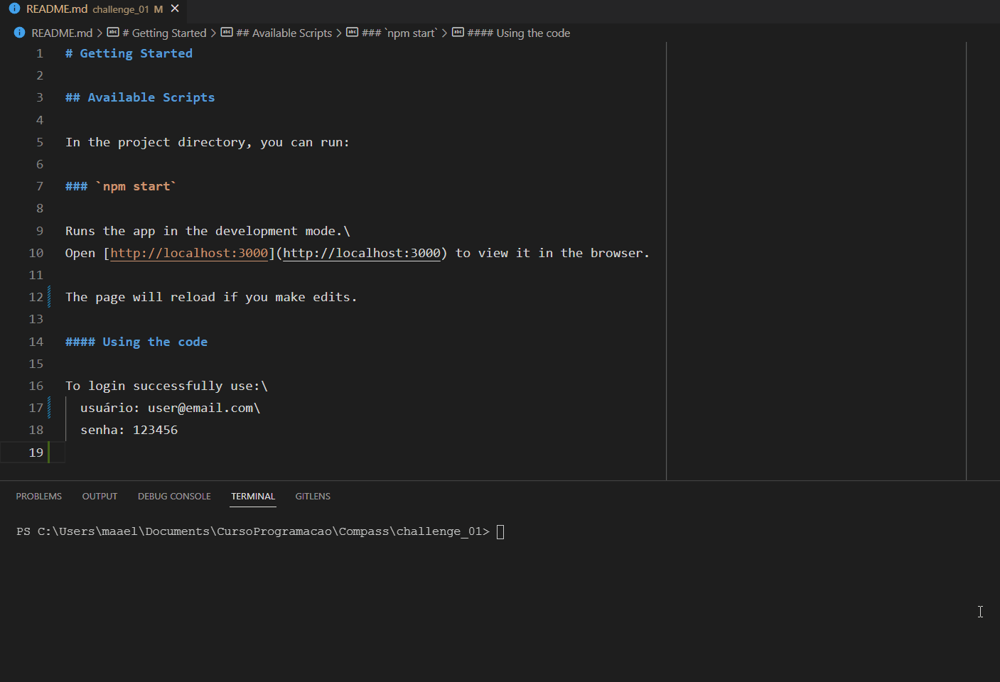

# Getting Started

## Available Scripts

In the project directory, you can run:

### `npm start`

Runs the app in the development mode.\
Open [http://localhost:3000](http://localhost:3000) to view it in the browser.

The page will reload if you make edits.

### Deploy
Open [https://challenge-01-compass.vercel.app](https://challenge-01-compass.vercel.app) to view it in the browser.

### Using the code

To login successfully use:\
  usuário: user@email.com\
  senha: 123456

  

